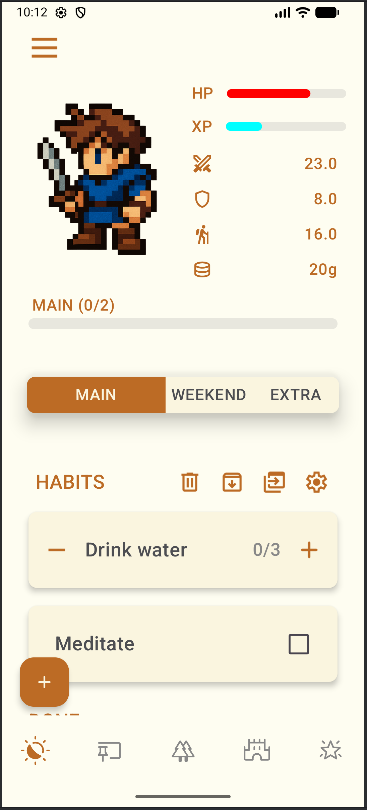

## Introducción

Proyecto personal que consiste en un desarrollo android nativo en Android Studio utilizando Kotlin y Jetpack Compose.

## Tecnologías

> Kotlin
> Jetpack Compose
> Android Studio
> Android Jetpack
> Room (SQLite)
> DataStore
> MVVM
> Coroutines
> Hilt/Dagger
> Material 3
> JUnit, Espresso
> WorkManager
> Navigation Component
> GitHub

## Descripción

El presente proyecto se centra en el diseño y desarrollo de una aplicación móvil orientada a la productividad, pues se pretende que a través de sus funciones los usuarios puedan adoptar unas conductas sanas y positivas, prestándose como herramienta de organización personal, promoviendo hábitos saludables y fomentando el bienestar emocional de sus usuarios. Para esto, dicha aplicación combinará, en cierto grado, elementos procedentes del ámbito de la psicología con funcionalidades propias de la gestión de rutinas y tareas diarias, empleando mecánicas de gamificación.

Para lograr esto, Hero's Journey es una app que se inspira en las mecánicas y estética de los videojuegos de rol (RPG) de fantasía medieval, implementa un estilo gráfico pixel art en alguna de sus secciones y adopta un enfoque naíf, que lejos de coaccionar al usuario con mensajes excesivamente rígidos, lo que hace es ofrecerle un entorno lúdico, agradable y motivador para desarrollar su productividad.

## Capturas de pantalla

   